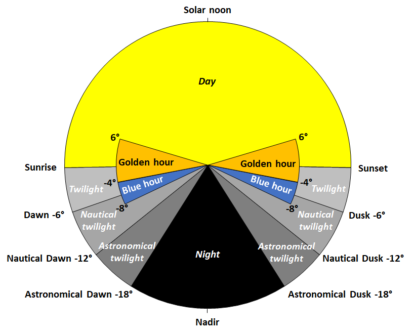

# Advanced Scheduler Hilfeseite

[English version](/com.fp.advanced-scheduler/index.html)

## Ziel der App

Einige Hauptideen, die diese App ins Leben gerufen haben:
* Auf einfache Weise Dinge planen zu können, die in Ihrem Homey-System ausgeführt werden sollen.
* Vermeidung von VIELEN unterschiedlichen Flows mit unterschiedlichen Zeittriggern, nur weil diese mehrmals am Tag ausgeführt werden sollen.
* Vermeidung von noch mehr oder unnötig komplexen Flows, wenn Sie an verschiedenen Wochentagen ein unterschiedliches Verhalten wünschen.
* Einheitliche Vorgehensweise beim Planen von Ereignissen, egal ob diese zeit- oder sonnenereignisbasiert sind.

## Funktionen der App
In der App legen Sie Regeln fest, wann verschiedene Aktionen ausgeführt werden sollen.

Die Bedeutung von "wann" in diesem Zusammenhang betrifft zwei Dinge. Wann werden Abläufe ausgelöst und wann werden Werte von Tags geändert.

Die Bedeutung von "verschiedenen Aktionen" in diesem Zusammenhang ist: Was in den Flows ausgelöst werden soll. Dies wird durch den Aufbau der Flows UND durch die Werte, der in den zuvor genannten Tags gesteuert.

## Aufbau der Einstellungen

Nachfolgend finden Sie eine Übersicht über den Aufbau eines Zeitplanereignisses, wie er in der App definiert ist. Die App kann viele Zeitplanereignisses enthalten.


```    
Zeitplan
     |
     |- Enthält Tag-Definitionen (null oder mehr)
     |
     -- Enthält Zeitplanereignisse (null oder mehr)
             |
             -- Enthält Tags mit zu setzenden Werten (null oder mehr aus den obigen Tag-Definitionen)
```

Ein Zeitplan kann also Tag-Definitionen (mehr zu diesem Thema in Kürze) und Zeitplanereignisse enthalten. Jedes Zeitplanereignis stellt eine Zeit im Zeitplan dar. Diese Zeit kann fix sein oder auf Sonnenereignissen basieren (Sonnenuntergang, Sonnenaufgang usw.). Ein Zeitplanereignis informiert darüber, an welchem Wochentag dieser aktiv ist. Man hat die Wahl, von null Tagen (was nicht wirklich Sinn macht) bis hin zu allen sieben Tagen pro Woche, und das in jeder gewünschten Kombination.

Die im Zeitplan enthaltenen Tag-Definitionen sind ein einfacher Weg mit der "Außenwelt" zu interagieren und die Steuerung von Abläufen zu ermöglichen. Definieren Sie boolesche, numerische oder aus einer Zeichenfolge erstellte Tags und geben ihnen einen sinnvollen Namen.

Nach dem Einrichten der im Zeitplan enthaltenen Tag-Definitionen können diese zu den Zeitplanereignissen hinzugefügt werden. Wenn ein Zeitplanereignis erstellt wird, werden alle in diesem Zeitplan definierten Variablen automatisch zu dem Zeitplanereignis hinzugefügt. Für jedes Tag im Zeitplanereignis legen Sie einen Wert fest. Dieser Wert (oder diese Werte, wenn mehrere Tags verwendet werden) wird von der App gesetzt wenn das Zeitplanereignis ausgelöst wird.

NEEDS TRANSLATION!
## Details on schedule events

A schedule can trigger based on a fixed time or solar events. Apart from this it is possible to make additions and exceptions to the triggers. 

### Random trigger time

If you specify a random time, the app will set a triggering time between the main trigger and the random time. The random time can be a fixed time or a solar event.

### First or last 

When using a solar event the triggering time varies depending on the time of year. If you for example want to turn on a lamp at sunset, but not later than 21:00 then you setup the schedule event to trigger at the first of sunset and 21:00. The same can be used but triggering the last of two times.

### Only trigger if before and/or after

When using a solar event the triggering time varies depending on the time of year. If you for example want to turn on a lamp at sunset, but not if later than 21:00 then you setup the schedule event to trigger at sunset but only if before 21:00. 

### Combination of triggers and conditions

The possibilities described above can be combined as desired. Please note that some combinations will result in the schedule event never triggering. Consider for example triggering at sunrise but not before 21:00. This will not happen in many places of the world :-)

NEEDS TRANSLATION!

## Szenarien und Beispiele
### Szenario 1
**Eine Lampe oder ein anderes Gerät zu regelmäßigen Zeiten ein-/ausschalten. In diesem Szenario jeden Tag um 19:00 Uhr ein- und um 07:00 Uhr ausschalten**

Vorgehensweise:
1. Fügen Sie einen neuen Zeitplan hinzu, nennen Sie ihn z.B. "Wöchentliches Nachtlicht an".
1. Fügen Sie unter **Tag-Definitionen** ein neues **Tag** vom Typ Boolesche hinzu und nennen es "An".
1. Fügen Sie ein neues **Zeitplanelement** hinzu. Bearbeiten Sie dieses und geben 19:00 ein, dann auf Schließen tippen.
1. Aktivieren Sie den **Tag-Schalter**.
1. Wiederholen Sie den Vorgang für ein weiteres **Zeitplanelement**, tragen diesmal aber 07:00 ein und belassen den **Tag-Schalter** deaktiviert.
1. Erstellen Sie einen Flow und beginnen mit der "Wenn..." Karte: Advanced Scheduler -> Zeitplan ausgelöst und wählen Sie den Zeitplan "Wöchentliches Nachtlicht an" aus.
1. Im Bereich "Und..." fügen sie die Logik-Karte "Logik ist ja/nein" hinzu und wählen das Tag "Wöchentliches Nachtlicht an - An" aus.
1. Im Bereich "Dann..." fügen Sie das Gerät hinzu welches eingeschaltet werden soll. Fügen Sie das Gerät ein zweites Mal hinzu, diesmal aber das es ausgeschaltet werden soll und ziehen Sie die Karte in die Sonst-Position.

_Das alles mag übertrieben erscheinen, weil dieser Ablauf mit zwei Flows realisiert werden könnte, aber die Leistungsfähigkeit der App wird sich in den kommenden Szenarien noch zeigen._

### Szenario 2
**Eine Lampe oder ein anderes Gerät zu Sonnenereignissen ein-/ausschalten (wenn gewünscht mit einer Offset-Zeit). In diesem Szenario jeden Tag bei Sonnenuntergang ein- und bei Sonnenaufgang ausschalten.**

Vorgehensweise:
1. Erweitern Sie den **Zeitplan**, der in Szenario 1 oben erstellt wurde.
1. Um die **Zeitplanelemete** zu editieren, tippen Sie auf den Editier-Button.
1. Ändern Sie Zeit in den Typ **Solar** und wählen Sie **Sonnenuntergang** bzw. **Sonnenaufgang**. Wenn gewünscht fügen Sie noch eine Offset-Zeit hinzu.

_Das alles mag übertrieben erscheinen, weil dieser Ablauf mit zwei Flows und der Sonnenereignisse App realisiert werden könnte, aber die Leistungsfähigkeit der App wird sich in den kommenden Szenarien noch zeigen._

### Szenario 3
**Eine Lampe oder ein anderes Gerät zu Sonnenereignissen ein-/ausschalten (wenn gewünscht mit einer Offset-Zeit) und während einer definierten Zeit in der Nacht ausschalten. In diesem Szenario jeden Tag bei Sonnenuntergang ein- und bei Sonnenaufgang ausschalten. Außerdem zwischen 23:00 und 05:00 Uhr ausschalten.**

Vorgehensweise:
1. Erweitern Sie den **Zeitplan**, der in Szenario 1 und 2 erstellt wurde.
1. Fügen Sie zwei neue **Zeitplanelemente** hinzu.
1. Stellen Sie die **Auslösezeit** auf 23:00 bzw. 05:00 ein.
1. Aktivieren/deaktivieren Sie den **Tag-Schalter** entsprechend.

_Dieser Ablauf könnte mit zwei weiteren Zeit-Flows, also insgesamt vier Flows, realisiert werden. Langsam kann man die Leistungsfähigkeit der App erahnen._

### Szenario 4
**Eine Lampe oder ein anderes Gerät zu regelmäßigen Zeiten ein-/ausschalten, allerdings zu unterschiedlichen Zeiten an unterschiedlichen Wochentagen.**

Vorgehensweise:
1. Fügen Sie einen neuen Zeitplan hinzu, nennen Sie ihn z.B. "Licht beim Frühstück an".
1. Fügen Sie unter **Tag-Definitionen** ein neues **Tag** vom Typ Boolesche hinzu und nennen es "An".
1. Fügen Sie ein neues **Zeitplanelement** hinzu. Bearbeiten Sie dieses und geben 06:00 ein. Wählen Sie die Wochentage (Mo-Fr) im Dropdown-Menü aus, dann auf Schließen tippen.
1. Aktivieren Sie den **Tag-Schalter**.
1. Fügen Sie ein neues **Zeitplanelement** hinzu. Bearbeiten Sie dieses und geben 07:00 ein. Wählen Sie die Wochentage (Mo-Fr) im Dropdown-Menü aus, dann auf Schließen tippen.
1. Deaktivieren Sie den **Tag-Schalter**.
1. Fügen Sie ein neues **Zeitplanelement** hinzu. Bearbeiten Sie dieses und geben 09:00 ein. Wählen Sie die Wochenendtage (Sa-So) im Dropdown-Menü aus, dann auf Schließen tippen.
1. Aktivieren Sie den **Tag-Schalter**.
1. Fügen Sie ein neues **Zeitplanelement** hinzu. Bearbeiten Sie dieses und geben 10:00 ein. Wählen Sie die Wochenendtage (Sa-So) im Dropdown-Menü aus, dann auf Schließen tippen.
1. Deaktivieren Sie den **Tag-Schalter**.
1. Erstellen Sie einen Flow und beginnen mit der "Wenn..." Karte: Advanced Scheduler -> Zeitplan ausgelöst und wählen Sie den Zeitplan "Licht beim Frühstück an" aus.
1. Im Bereich "Und..." fügen Sie die Logik-Karte "Logik ist ja/nein" hinzu und wählen das Tag "Licht beim Frühstück an - An" aus.
1. Fügen Sie eine oder mehrere "Dann..." Karten hinzu, die das Licht einschalten und eine oder mehrere Sonst-Karten, die das Licht ausschalten sollen.

### Szenario 5, Alternative 1
**Eine Lampe oder ein anderes Gerät zu regelmäßigen Zeiten ein-/ausschalten UND ein dimmbares Gerät zu regelmäßigen Zeiten dimmen, aber zu unterschiedlichen Zeiten und Wochentagen.**

Vorgehensweise:
1. Öffnen Sie den Zeitplan, den Sie unter Szenario 4 erstellt haben.
1. Fügen Sie unter **Tag-Definitionen** ein neues **Tag** vom Typ Nummer hinzu und nennen es "DimVal".
1. Fügen Sie zu allen in Szenario 4 erstellten Zeitplanelementen das Tag "DimVal" hinzu und tragen den gewünschten Dimmwert ein (inzwischen sollten Sie wissen wie man das macht).
1. Wählen Sie den in Szenario 4 erstellten Flow aus.
1. Fügen Sie eine oder mehrere "Dann..." Karten sowie eine weitere "Sonst..." Karte für die zu dimmenden Lampen hinzu. Verwenden Sie in den Karten das Tag **Licht beim Frühstück an - DimVal**.

_Der Nachteil dabei ist, dass Sie zwei Aktionskarten zum Dimmen benötigen, da wir eine "Dann/Sonst"-Logik haben._

### Szenario 5, Alternative 2
**Eine Lampe oder ein anderes Gerät zu regelmäßigen Zeiten ein-/ausschalten UND ein dimmbares Gerät zu regelmäßigen Zeiten dimmen, aber zu unterschiedlichen Zeiten und Wochentagen.**

Vorgehensweise:
1. Öffnen Sie den Zeitplan, den Sie unter Szenario 4 erstellt haben.
1. Führen Sie die Schritte wie in Alternative 1 aus, bis Sie zu dem Flow-Teil kommen.
1. Erstellen Sie einen neuen Flow und beginnen mit der "Wenn..." Karte: Advanced Scheduler -> Zeitplan ausgelöst und wählen Sie den Zeitplan "Licht beim Frühstück an" aus.
1. Nennen Sie den Flow beispielsweise "Licht beim Frühstück dimmen".
1. Fügen Sie eine oder mehrere "Dann..." Karten für die zu dimmenden Lampen hinzu. Verwenden Sie in der Karten das Tag **Licht beim Frühstück an - DimVal**.

_Der Nachteil dabei ist, dass Sie einen zusätzlichen Flow für das zu dimmende Gerät benötigen. Aber im Gegensatz zu zwei benötigten Karten in Alternative 1, brauchen Sie hier nur eine Aktionskarte._

**Wie Sie sehen, können Sie mit dieser App SEHR komplexe Zeitpläne erstellen ohne das komplexe Abläufe erforderlich sind.**

## Details

Es ist durchaus möglich Tags in einem Zeitplan zu definieren, die nicht in den Zeitplanereignissen verwendet werden. Die Tag-Werte für ein bestimmtes Tag werden nur geändert, wenn diesem Zeitplanereignis ein Tag hinzugefügt wird. Vielleicht möchten Sie nur in einigen Ereignissen einen bestimmten Tag-Wert ändern. In diesem Fall entfernen Sie einfach die betreffenden Tags mit der Schaltfläche "Papierkorb".

Needs translation!
## Solar events described with a picture

